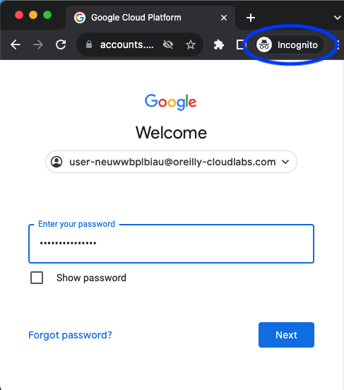

This sandbox provides a temporary generated username and password to work with Google Cloud (GCP). When starting this sandbox, it takes a moment to create these credentials.

You can log into the Google Cloud console using the login credentials provided in the terminal window at the beginning of the sandbox. 



**NOTE**: We recommend using an incognito or private browsing window, especially if you have an existing GCP account. The first time you log in to the Google Cloud console, you will be prompted to accept the terms of service. You can accept the default settings and click *Agree and Continue*. 

If you need to be reminded of the username and password, run the following command at any moment:

`get_credentials`{{execute}}

### Enable services

To enable a service, enter the following command in the terminal with the service you want:

```
gcloud services enable <SERVICE>
```

In the next steps you will find some example commands you can run in this sandbox.

**NOTE**: Some commands in this sandbox may take several minutes to run.